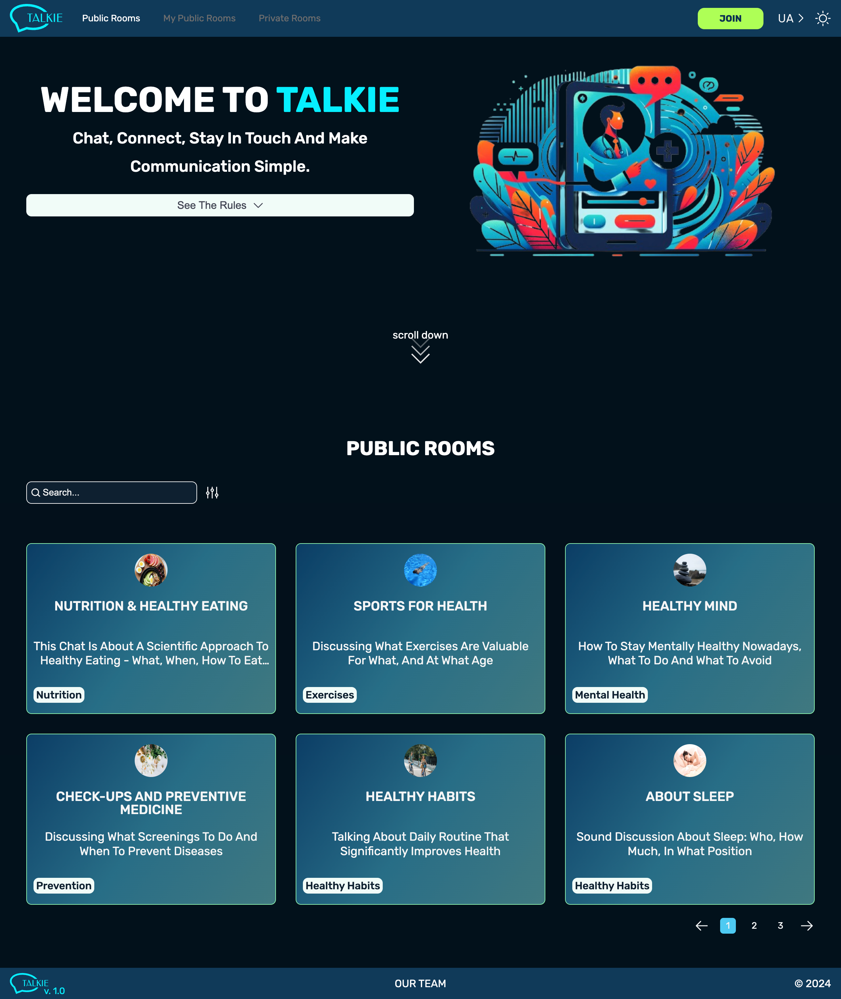

# Talkie

**DEMO**: https://talkiehub.netlify.app

Welcome to Talkie, a real-time chat application that allows users to join discussions on various topics. With a simple and lightweight design, Talkie enables users to engage in conversations without the need for authorization, making it easy to connect with others quickly.

- **Chat Rooms:** Users can join different chat rooms corresponding to various topics.
- **Username-only Authentication:** Authorization is not required; users can join using only a username.
- **Multi-User Chat:** More than two users can participate in a chat simultaneously, even with the same nicknames.

### Technologies Used:

**Front-end:**

- **React.js:** Powering the dynamic and responsive user interface.
- **Redux Toolkit:** Managing the state of the application efficiently.
- **TypeScript:** Ensuring a robust and statically-typed codebase.
- **ESLint, Prettire:** Ensuring code quality and adherence to best practices.

**Back-end:**

- **Express:** A minimal and flexible Node.js web application framework.
- **MongoDB:** A NoSQL database for storing and retrieving chat-related data.

### Features:

- **Interest-Based Chat Rooms:** Users can create and join rooms based on shared interests.
- **Private Messaging:** Send and receive private messages with unread message notifications.
- **Search and Filter for Public Rooms:** Users can search and filter public rooms based on topics, making it easier to find discussions of interest.
- **Search by Topics for Private Rooms:** Private room searches are topic-based, allowing users to discover private discussions aligned with their interests.
- **Create/Delete/Edit My Public Rooms:** Users can create, delete, and edit public rooms they own, providing control over the room's content and moderation.
- **Theme Change:** Customize your experience by changing the theme of the website to suit your mood.
- **Language Change:** Change the language of the application for a personalized experience.

### Installation:

```
npm i
npm run dev
```

Runs the app in the development mode.
Open http://localhost:5173 to view it in your browser.


